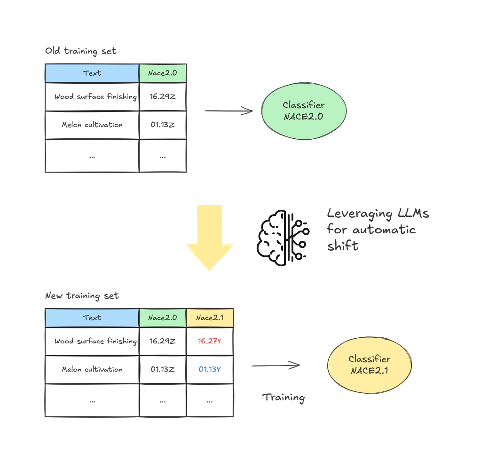
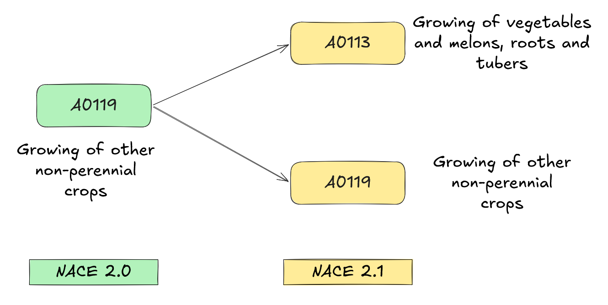
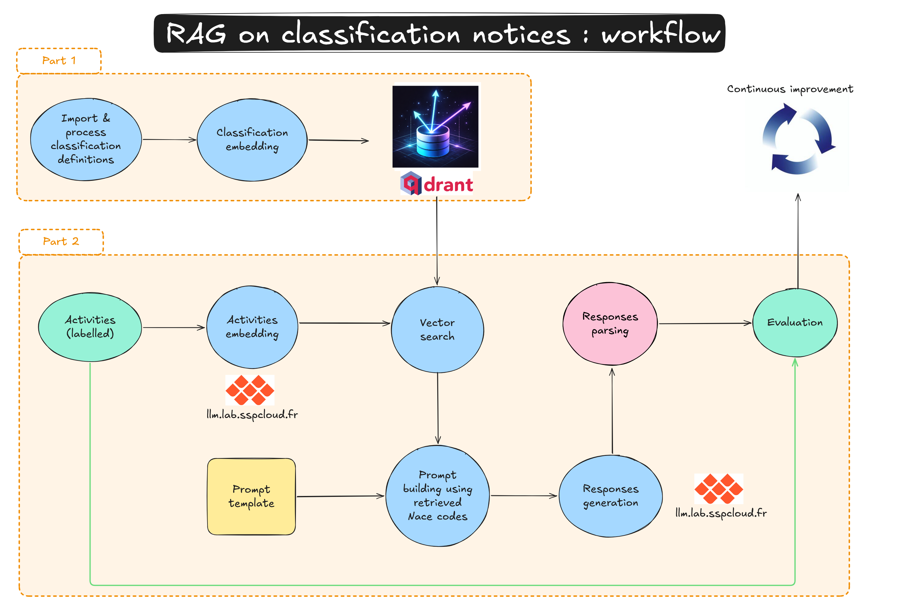

# Introduction {#chapters_0 .backgroundTitre_bleu}

::: {.notes}
Hello everyone, thank you for being here. I'm Julien Pramil, data scientist at Insee's innovation lab.
Twenty minutes on how we use LLMs to handle a structural problem in official statistics: what happens when an official classification changes and a production model can no longer be retrained the standard way.
:::

## Outline {#section_0_1 .backgroundStandard_bleu .smaller}

:::{.enteteAvecTitre}
Introduction
:::

1. **The problem** — A model whose target variable is changing
2. **Human and virtual annotation** — Combining expert and machine knowledge
3. **Methodology** — A constrained LLM pipeline with Rule-Based Augmented Generation
4. **Infrastructure** — Open-source MLOps on the SSPCloud
5. **Results** — Performance of the retrained classifier
6. **An alternative: pure RAG** — When no legacy labels exist
7. **Conclusion and perspectives**

::: {.notes}
Quick roadmap. First the problem — why classification revisions break standard ML. Then how we use LLMs as virtual annotators to relabel an existing training corpus, with a quick word on infrastructure. Then the results. A short detour on an alternative pure-RAG variant, and a brief conclusion.
:::

# 1. The Problem {#chapters_1 .backgroundTitre_violet}

::: {.notes}
Let me frame the problem first.
:::

## When a classification is revised {#section_1_1 .backgroundStandard_violet}

:::{.enteteAvecTitre}
The Problem
:::

::: {.columns}

A recurring challenge for every statistical institute (NACE, COICOP, ISCO, …). 

::: {.column width="50%"}
**Standard ML maintenance**

- Inputs may drift over time
- We monitor and **retrain on fresh labels**
- The target variable stays the **same**
:::

::: {.column width="50%"}
**Classification revision**

- The **target variable itself changes**
- New labelled data are **scarce or missing**
- Legacy labels are in the **wrong space**
- Standard retraining is **not possible**
:::

:::

- At Insee, a **TorchTextClassifiers** classifier (fastText inspired) in production since 2023 to assign NACE 2.0 codes
- Trained on a 2.7 millions labels trainset.

**Central question**: how can we leverage years of accumulated production knowledge in the old classification to bootstrap a model in the new one?

::: {.notes}
In normal ML maintenance, what changes is the inputs — you retrain on fresh labels and the target stays the same. With a classification revision it's different: the Y itself changes. Old codes are gone or shifted, and fresh labels in the new classification don't exist yet.

At Insee we have a fastText inspired classifier in production since twenty twenty-three (powered by the TorchTextClassifiers stack) — two point seven million NACE 2.0 labels behind it. Our question: how do we leverage that asset to bootstrap a model in NACE 2.1, without waiting two or three years for a fresh manually-labelled corpus?
:::

## Our strategy: shifting the old trainset {#section_1_2 .backgroundStandard_violet}

:::{.enteteAvecTitre}
The Problem
:::

{fig-align="center" width=50%}

::: {.notes}
The strategy is here on the diagram. We use LLMs once, offline, to relabel our legacy NACE 2.0 training corpus into NACE 2.1. Then we train a new classifier on the relabelled corpus. The LLM is not a real-time auto-coder — it's a translation tool used once.
:::

## NACE 2.0 → 2.1 and the multivocal codes {#section_1_3 .backgroundStandard_violet}

:::{.enteteAvecTitre}
The Problem
:::

::: {.columns}

::: {.column width="50%"}
**Timeline at Insee**

- **2025** — Dual coding period
- **2026** — Quality improvement
- **2027** — NACE 2.1 becomes the production standard

**Scope of the change**

- Level 5 (sub-classes): **746** vs **732**
- Mostly splits at level 4, with a few merges and recompositions
:::

::: {.column width="50%" style="margin-top: 3em;"}
**Univocal** (1-to-1) — 551 classes — direct mapping.
**Multivocal** (1-to-N) — 181 classes — up to **38** candidates.

{fig-align="center" width=90%}
:::

:::

::: {.notes}
NACE 2.1 is being adopted across European NSIs. At Insee: twenty twenty-five dual coding, twenty twenty-six quality, twenty twenty-seven production. The change itself is moderate — seven hundred and thirty-two to seven hundred and forty-six codes at the most detailed level.

The complexity is that the correspondence is not a bijection. About five hundred and fifty-one codes have a clean one-to-one mapping — easy, table lookup. But one hundred and eighty-one codes are multivocal: one source code maps to several new codes, up to thirty-eight in extreme cases. The table alone cannot tell you which one is right — you need the activity description and expert judgement.
:::

## The scale of the problem {#section_1_3b .backgroundStandard_violet}

:::{.enteteAvecTitre}
The Problem
:::

::: {.columns style="margin-top: 1em;"}

::: {.column width="55%"}
| | Multivocal | Univocal |
|---|---|---|
| Correspondence table | 25 % | 75 % |
| Actual training set | **52 %** | 48 % |
:::

::: {.column width="45%" style="text-align: center; padding-top: 0.5em;"}
[~1.4 M]{style="font-size: 2.5em; font-weight: bold;"}

observations that cannot be recoded by table lookup
:::

:::

[The problem cannot be solved by a deterministic mapping table alone.]{.bold}

::: {.notes}
And these multivocal codes asre not rare. In the theoretical table they're twenty-five percent — but weighted by the actual distribution in our training set, it jumps to fifty-two percent. About one point four million observations we can't recode by table lookup alone. Far too many for human experts.
:::


# 2. Human and Virtual Annotation {#chapters_2 .backgroundTitre_vert}

::: {.notes}
Quick chapter on annotation.
:::

## Human ground truth, machine scaling {#section_2_1 .backgroundStandard_vert}

:::{.enteteAvecTitre}
Human and Virtual Annotation
:::

::: {.columns}

::: {.column width="50%"}
### NACE 2.1 ground truth campaign

- **~30k annotations** directly in NACE 2.1
- **~25 NACE experts**
- Focused on **multivocal cases** — the hard ones
- Candidates pre-filtered via the legacy NACE 2.0 code
- For each item: assign a code · delegate · mark uncodable
:::

::: {.column width="50%"}
### What we learned

**A realistic baseline for evaluation**

- 3-way blind re-annotation: **~62 %** strict agreement · **~96 %** majority
- → even experts disagree — matching a single human perfectly is **not the target**

**An explicit expert reasoning protocol**

- description → check legacy code → consult candidates and explanatory notes → decide
- → a sequence we can **encode into an LLM prompt** at scale
:::

:::

::: {.notes}
We mobilised about twenty-five NACE experts across France to annotate roughly thirty thousand items directly in the new NACE 2.1 classification. We focused on the multivocal cases — the difficult ones where the correspondence table alone is not enough. To make the task manageable, the candidate codes were pre-filtered using the legacy NACE 2.0 code already known. For each item, annotators could assign a code, delegate to a colleague if they lacked expertise, or mark the item as uncodable. This campaign gives us our ground truth — the only reference we have in NACE 2.1.

Two quick observations from that campaign.

First, a realistic baseline. We ran a controlled exercise where three volunteer experts blindly re-annotated the same sample. Strict three-way agreement was only sixty-two percent — but two-out-of-three agreement reached ninety-six percent. The lesson is clear: even trained experts disagree on roughly four cases out of ten when you require unanimity. So we shouldn't expect the LLM to match a single human perfectly — what we want is alignment within the range of natural human variability.

Second, the campaign made the expert reasoning explicit. Read the description, check whether the legacy code is consistent, consult the candidate codes and their explanatory notes, then decide or mark uncodable. This sequence is precise enough that we can translate it into an LLM prompt — that's exactly the next chapter.
:::


# 3. Methodology {#chapters_3 .backgroundTitre_bleu}

::: {.notes}
The pipeline itself.
:::

## Rule-Based Augmented Generation as<br>constrained selection {#section_3_1 .backgroundStandard_bleu}

:::{.enteteAvecTitre}
Methodology
:::

**Why not ask the LLM directly?**

- NACE 2.1 is too recent — barely in any pre-training corpus
- Without context, the model falls back on **NACE 2.0**
- Even with a known classification: **746 codes** is too large a space for reliable open generation

**Constrained selection instead:**

- For each observation, we already know the **NACE 2.0 code**
- The correspondence table gives the **set of admissible NACE 2.1 codes**
- The task becomes: **pick the right code from a short, restricted list**

[Without context, the model hallucinates. With context, it disambiguates.]{.bold .bleu_insee}

::: {.notes}
First decision: don't ask the LLM directly to classify into seven hundred and forty-six codes. Two reasons. NACE 2.1 is too recent — barely in any pre-training corpus, so the model falls back on NACE 2.0. And anyway, seven hundred and forty-six codes is a too large space for reliable open generation.

Instead: constrained selection. For each observation we know the legacy NACE 2.0 code. The correspondence table gives us the admissible NACE 2.1 codes — usually two to five. We ask the LLM to pick from that short list. Manageable prompt, decisions aligned with official rules.
:::

## The pipeline {#section_3_2 .backgroundStandard_bleu}

:::{.enteteAvecTitre}
Methodology
:::

::: {.columns}

::: {.column width="60%"}
**For each observation**:

1. Retrieve the activity description (free text + optional precisions: agricultural details, secondary activity, legal category)
2. Retrieve the legacy NACE 2.0 code
3. Use the correspondence table to get the set of candidate NACE 2.1 codes
4. Inject the **explanatory notes** of each candidate code into the prompt
5. Ask the LLM to pick the most appropriate code
6. Parse the structured JSON response

A form of **Rule-Based Augmented Generation (RBAG)** with a deterministic retriever.
:::

::: {.column width="40%"}
<br>

**Inputs to the prompt**

| Element | Source |
|---------|--------|
| Activity text + precisions | Production register |
| NACE 2.0 code | Insee NACE Experts |
| Candidate set | Correspondence table |
| Explanatory notes | Official NACE 2.1 documentation |
:::

:::

::: {.notes}
Let's describe the six steps pipeline. 

- Get the activity text, 
- get the legacy code, 
- look up the candidates from the table, 
- inject the official explanatory notes for each candidate, 
- ask the LLM to pick, parse the JSON response.

The key idea is in step four. The explanatory notes are the official prose definitions — with inclusion and exclusion rules and examples — written by the classification authority. We inject those into the prompt: same reference material a human expert would consult.

Let's call this Rule-Based Augmented Generation (RBAG), by analogy with RAG. Same idea but the retriever is not vector search — it's a deterministic lookup in an official table.
:::

## The prompt structure {#section_3_3 .backgroundStandard_bleu}

:::{.enteteAvecTitre}
Methodology
:::

::: {.columns}

::: {.column width="55%"}
**System prompt** — same for every observation

> *You are an expert in the NACE classification. Your task is to assign a NACE 2.1 code to a business based on its activity description, using a candidate list derived from the existing NACE 2.0 code…*

**User prompt** — observation-specific

```
# Main activity : {{activity}}
# NACE 2.0 code : {{nace_old}}
# Candidate NACE 2.1 codes + notes : {{proposed_codes}}
========
# Instructions (7 rules)
  → candidate list only — no external code
  → first activity only
  → strict JSON — no explanation
```
:::

::: {.column width="45%"}
**Expected output**

```json
{
  "codable": true,
  "nace2025": "0147J",
  "nace08_valid": true,
  "confidence": 0.92
}
```

- `codable`: was the description sufficient?
- `nace08_valid`: is the legacy code consistent?
- `nace2025`: the chosen code (or `null`)
- `confidence`: model self-assessment (0–1)
:::

:::

::: {.smaller style="margin-top: 0.5em;"}
**`{{proposed_codes}}`** — example:

```
86.95: Physiotherapy activities
  Includes: physiotherapy, medical massage, occupational therapy, praxitherapy…
  Does not include: osteopaths, chiropractors, non-medical massage parlors…

86.96: Traditional, complementary, and alternative medicine  [...]
86.99: Other human health activities n.e.c.  [...]
```
:::

::: {.notes}
The prompt has two parts. A system prompt — same every time, defines the role. A user prompt — observation-specific, with the activity, the legacy code, the candidate codes plus notes, and seven explicit rules.

Output is a structured JSON with four fields. 

- Codable: was the description sufficient (LLM's self assessement). 
- nace2025: the chosen code. 
- nace08_valid: a useful side benefit — the model flags suspicious legacy codes. 
- Confidence: LLM's self-assessed classification confidence, used to filter low-confidence cases.

Forcing strict JSON is essential at scale — free-text answers are expensive to parse reliably.
:::


## Multi-model annotation {#section_3_5 .backgroundStandard_bleu}

:::{.enteteAvecTitre}
Methodology
:::

| Model | Size | Inference speed | Behaviour |
|-------------|------|-----------------|-----------|
| Qwen3-6-35B MoE | 35B | Very fast (13.37 it/s) | Moderately restrictive |
| Qwen3-6-35B MoE + thinking | 35B | Less fast (0.95 it/s) | Less restrictive |
| Gemma4-26B MoE | 26B | Fast (7.87 it/s) | Moderately restrictive |

**Aggregation**: majority vote


::: {.notes}
We tried not to rely on a single LLM. So, we launch the classification process with three open-source MoE models in parallel — Qwen3-6-35B (with and without thinking) and Gemma4-26B.
They differ in size, throughput, and how often they decline when uncertain. The two Qwen3 runs share the same weights but the thinking variant trades a roughly tenfold slowdown — from seventy-four milliseconds per iteration down to about one per second — for an explicit reasoning trace, and turns out to be less restrictive. Gemma4 sits in between, at one hundred and twenty-seven milliseconds per iteration.

Each one is used as an independent virtual annotator. We aggregate the three predictions via a majority vote to make the final relabelling more accurate. Same idea as any ensemble: complementary errors cancel out.
:::

# 4. Infrastructure {#chapters_4 .backgroundTitre_violet}

::: {.notes}
A quick word on infrastructure.
:::

## Our MLOps stack on the SSPCloud {#section_4_1 .backgroundStandard_violet}

:::{.enteteAvecTitre}
Infrastructure
:::

**SSPCloud** — Insee's cloud-based data science platform, built on the open-source **Onyxia** — runs our full stack as **one-click managed services** in every project:

- **Kubernetes** — substrate; every component is a containerised workload
- **llm.lab** — SSPCloud's LLM gateway, powered by **OpenWebUI + vLLM**
- **Langfuse** — prompt versioning; every call logged
- **MLflow** — experiment tracking for the downstream classifier
- **Argo Workflows** — the end-to-end pipeline as a reproducible DAG
- **MinIO** — S3-compatible storage for datasets and model artefacts

::: {style="text-align: center; margin-top: 1em;"}
{height=50px style="margin: 0 0.6em;"}
{height=50px style="margin: 0 0.6em;"}
{height=50px style="margin: 0 0.6em;"}
{height=50px style="margin: 0 0.6em;"}
{height=50px style="margin: 0 0.6em;"}
{height=50px style="margin: 0 0.6em;"}
{height=50px style="margin: 0 0.6em;"}
{height=50px style="margin: 0 0.6em;"}
:::

[Entirely open-source, containerised, reproducible.]{.bold}

::: {.notes}
Everything runs on SSPCloud, Insee's data science platform, built on the open-source Onyxia. The point is operational: SSPCloud makes our full stack available as one-click managed services — we don't deploy or maintain any of these tools ourselves.

Kubernetes is the substrate. For LLM inference we don't call vLLM directly — we go through llm.lab, SSPCloud's gateway, which uses OpenWebUI and vLLM under the hood. Langfuse versions every prompt. MLflow tracks the classifier training. Argo Workflows orchestrates the pipeline as a Directed Acyclic Graph. MinIO is the shared S3 storage.
:::

# 5. Results {#chapters_5 .backgroundTitre_jaune}

::: {.notes}
Now the results.
:::

## Grading the LLM annotators {#section_5_1 .backgroundStandard_jaune}

:::{.enteteAvecTitre}
Results
:::

- Reference: the **~30,000 manually annotated** multivocal cases (NACE 2.1, level 5)
- Three complementary accuracies — at the most detailed level (sub-class):
  1. **Overall** — across all observations
  2. **Codable subset** — restricted to predictions the LLM itself flagged as codable
  3. **LLM-only** — restricted to cases where the ground-truth code is reachable from the legacy NACE 2.0 code (errors imputable to generation alone)

A substantial share of disagreements are not LLM errors but ambiguous descriptions or legacy-coding mistakes.

::: {.notes}
Evaluation is hard. The reference is the thirty thousand annotated cases, which themselves have human disagreement. We use three metrics: overall accuracy, accuracy on the codable subset, and LLM-only accuracy that factors out cases where the legacy code couldn't even reach the right answer in the new classification. A naive evaluation underestimates the model substantially.
:::

## Per-model and ensemble accuracy {#section_5_1a .backgroundStandard_jaune}

:::{.enteteAvecTitre}
Results
:::

Accuracies at level 5 (sub-class) — % of cases where the predicted code matches the manual annotation.

| Model | Inference | Overall | Codable | LLM-only |
|-------|----------:|--------:|--------:|---------:|
| Qwen3-6-35B MoE | 75 ms/it | 75.2 % | 78.3 % | 83.3 % |
| Qwen3-6-35B MoE + thinking | ~1 s/it | 75.7 % | 80.4 % | 84.1 % |
| Gemma4-26B MoE | 127 ms/it | 75.2 % | 80.0 % | 83.5 % |
| [**Majority vote**]{.bold} | — | [**78.3 %**]{.bold} | — | [**86.9 %**]{.bold} |

[The codable filter is per-model, hence the dash for the ensemble vote.]{.small}

::: {.notes}
At level 5 — the most detailed sub-class — each individual model lands around seventy-five percent overall, eighty percent on the codable subset, and eighty-three to eighty-four percent on the LLM-only subset. The thinking variant of Qwen3 adds about two points on the codable subset and about one point on the LLM-only subset compared to the non-thinking one — at a roughly tenfold inference cost. Gemma sits in between.

The majority vote is the clear winner: seventy-eight percent overall (three points above the best individual model) and eighty-seven percent on the LLM-only subset. The codable column is empty for the vote because the codable filter is defined per model, not at the ensemble level.
:::

## Reconstructing the training set {#section_5_1b .backgroundStandard_jaune}

:::{.enteteAvecTitre}
Results
:::

- **~1.4 M multivocal** observations relabelled via the LLM pipeline
- Combined with **1.3 M univocal** observations (table lookup)
- **~2 M** labels in NACE 2.1
- Distribution across codes is **very close** to the original distribution

::: {.callout-tip}
This is **semi-synthetic** data: labels are generated algorithmically, but grounded in real observations and structured domain knowledge.
:::

::: {.notes}
Once happy with the LLM on the benchmark, we apply at scale: one point three million univocal items by table lookup, one point four million multivocal items through the LLM pipeline, dropping low-confidence cases. About two million labels in NACE 2.1, with a distribution close to the original. I call this semi-synthetic — real businesses, real descriptions, algorithmic labels.
:::

## Performance of the retrained classifier {#section_5_2 .backgroundStandard_jaune}

:::{.enteteAvecTitre}
Results
:::

- A **fastText**-style classifier (and a more recent transformer-based model) is trained on the reconstructed corpus
- Standard ML practice: **train / validation / test** split, data editing, monitoring
- Overall accuracy of approximately **80 %** — comparable to the previous-generation NACE 2.0 model

::: {.fragment .fade-in}
[Take-away]{.bold}: semi-synthetic LLM-generated labels can substitute for manual annotations in the early stages of a classification transition.
:::

::: {.notes}
The key question: can a classifier trained on these LLM-generated labels match one trained on real human labels? We trained two variants — a fastText and a transformer-based model.

Following standard ML practice — train, val, test splits, data editing — we get around eighty percent overall accuracy. Comparable to what the previous-generation NACE 2.0 model achieves on its own task.

That's the main take-away of the talk: semi-synthetic LLM labels can substitute for manual annotations in the early stages of a classification transition.
:::

# 6. An Alternative: Pure RAG {#chapters_6 .backgroundTitre_vert}

::: {.notes}
A short detour on an alternative we're exploring in parallel.
:::

## Why try a pure RAG approach? {#section_6_1 .backgroundStandard_vert}

:::{.enteteAvecTitre}
An Alternative: Pure RAG
:::

::: {.columns}

::: {.column width="50%"}
**Limitations of RBAG**

- Relies on **legacy NACE 2.0 labels** → any annotation error in the old system is **propagated** into the new corpus
- Requires an **official correspondence table** — not always available
- Tied to the specific case of a **revision** of an existing classification
:::

::: {.column width="50%"}
**What RAG brings**

- **No propagation** of legacy labelling errors
- Works **when no historical labels exist** — new classifications, new domains, brand-new use cases
- A **more general** pipeline for any automatic coding task
- Gives us an **empirical benchmark**: how does RAG compare to RBAG in accuracy?
:::

:::

[Even where RBAG works, RAG is worth mastering — and quantifying.]{.bold}

::: {.notes}
RBAG has limits worth pointing out. It uses legacy NACE 2.0 labels as input — so any annotation error in the old system propagates. It needs an official correspondence table. And it only applies to a revision of an existing classification.

RAG is worth exploring: no dependency on legacy labels, works when no historical labels exist, more general for any coding task. And we want an empirical comparison — is RAG close to RBAG, or much worse?
:::

## What a RAG pipeline looks like {#section_6_2 .backgroundStandard_vert}

:::{.enteteAvecTitre}
An Alternative: Pure RAG
:::

{fig-align="center" width=60%}

::: {.notes}
RAG replaces the deterministic retriever with a semantic one. Offline: build a vector database of the NACE 2.1 explanatory notes. At inference: embed the activity description, retrieve the top-k most similar codes, inject candidates and notes into a prompt similar to RBAG, let the LLM pick.

Versus RBAG: more flexible — no dependency on the legacy code. The trade-off is not speed — retrieval is fast on our infrastructure — but operational complexity: an extra embedding model, vector database, and retriever to maintain.
:::

## RAG vs RBAG: results {#section_6_3 .backgroundStandard_vert}

:::{.enteteAvecTitre}
An Alternative: Pure RAG
:::

[qwen3-6-35b-moe · 28,499 multivocal obs · only the candidate-set source differs]{.smaller}

::: {.columns style="margin-top: 0.5em;"}

::: {.column width="55%"}
**Level-5 accuracy decomposition**

| | RBAG | Pure RAG |
|---|---|---|
| Truth in candidate set | **90.0 %** | 83.5 % |
| LLM picks right (when in set) | 83.4 % | 78.1 % |
| **Overall** | **75.3 %** | **65.3 %** |
:::

::: {.column width="45%"}
**The retriever is the bottleneck**

- RBAG floor: legacy NACE 2.0 mislabel rate (**~10 %**)
- RAG floor: retriever miss in top-5 (**~16.5 %**)
- Candidate-set gap (6.5 pts) > LLM-choice gap (3 pts)
:::

:::

[Closing the gap = pushing the retriever (better embeddings, reranker, larger k).]{.bold}

::: {.notes}
Same model qwen3-6-35b-moe, same evaluation set of about twenty-eight thousand five hundred multivocal observations, same prompt skeleton. Only the candidate-set source differs.

At the most detailed level five, RBAG reaches seventy-five point three percent. Pure RAG drops to sixty-five point three — about ten percentage points behind.

The decomposition tells us where the gap comes from. The candidate set contains the true code in ninety percent of RBAG cases — that's the legacy NACE 2.0 mislabel rate, our floor. For RAG, the top-five retrieved contain the truth only eighty-three and a half percent of the time — a sixteen and a half percent retriever miss rate. So the retriever loses to the legacy labels by six and a half points just on candidate quality.

The LLM also picks slightly worse from a top-five than from a narrow correspondence-table list — seventy-eight versus eighty-three percent — but the dominant factor is the candidate set.

Take-away: RAG is genuinely viable when legacy labels don't exist, but to close the gap we need a stronger retriever — better embeddings, a reranker, or a larger top-k.
:::

# 7. Conclusion and Perspectives {#chapters_7 .backgroundTitre_bleu}

::: {.notes}
Wrap-up.
:::

## Take-aways and what's next {#section_7_1 .backgroundStandard_bleu}

:::{.enteteAvecTitre}
Conclusion and Perspectives
:::

::: {.columns}

::: {.column width="50%"}
**Take-aways**

- A practical method to handle classification revisions in production ML
- LLMs as **virtual annotators** scale where humans cannot
- Semi-synthetic labels reach **production-grade accuracy** (~80 %)
- Fully open-source, reproducible MLOps stack
:::

::: {.column width="50%"}
**Limits & ongoing work**

- Inference cost is non-trivial at 2 M queries
- LLMs drift — versions must be pinned
- Legacy errors are inherited
- Improving the RAG variant — embeddings, rerankers, hierarchy-aware retrieval
- Extending to COICOP, ISCO, CPA…
:::

:::

::: {.notes}
What we've shown: classification revisions can be handled by treating LLMs as virtual annotators, constrained by the correspondence table and official explanatory notes. The classifier trained on the semi-synthetic corpus matches our previous-generation production model.

Why it matters: classification revisions are recurring — NACE every fifteen to twenty years, similar cycles for COICOP, ISCO, CPA. The traditional bottleneck is two to three years waiting for human annotations. This shortens that delay significantly.

A few open issues: inference cost is real, LLMs evolve fast so we pin versions, and we inherit upstream errors. On the methodology side we're improving the RAG variant and extending the approach to other classifications.
:::

## Acknowledgements {#section_7_3 .backgroundStandard_bleu .smaller}

:::{.enteteAvecTitre}
Conclusion and Perspectives
:::

::: {.columns}

::: {.column width="50%"}
- **SIRENE Quality Office** — first annotation campaign
- **APE business experts** — second annotation campaign
- **DNE** (Insee, Methodology and IT departments)
- **SSP Lab** — methodology and innovation
- **RIAS** (Regional Insee teams)
:::

::: {.column width="50%"}
**Code and slides are open**

- [github.com/InseeFrLab/codif-ape-nace-revision](https://github.com/InseeFrLab/codif-ape-nace-revision)
- [github.com/InseeFrLab/codif-ape-prez](https://github.com/InseeFrLab/codif-ape-prez)
- [github.com/InseeFrLab/codif-ape-graph-rag](https://github.com/InseeFrLab/codif-ape-graph-rag)

:::

:::

::: {.notes}
Quick thanks. The annotation campaigns mobilised the SIRENE Quality Office and the regional business experts. Methodology built with SSP Lab, our innovation lab. Integration with the methodology and IT departments and the regional teams. All code is open on InseeFrLab.
:::

## Selected references {#section_7_4 .backgroundStandard_bleu .smaller}

:::{.enteteAvecTitre}
Conclusion and Perspectives
:::

- Lewis, P., Piktus, A., Petroni, F., et al. (2020). *Retrieval-Augmented Generation for Knowledge-Intensive NLP Tasks*. arXiv:2005.11401.
- Spakulova, I., Lee, P. (2024). *ClassifAI – Exploring the use of Large Language Models (LLMs) to assign free text to commonly used classifications*. ONS Data Science Campus.
- Shorten, C., Pierse, C., et al. (2024). *StructuredRAG: JSON Response Formatting with Large Language Models*. arXiv:2408.11061.
- Huang, H., Huang, Y., et al. (2025). *Retrieval-Augmented Generation with Hierarchical Knowledge*. arXiv:2503.10150.
- Sutton, R. (2019). *The Bitter Lesson*. <http://www.incompleteideas.net/IncIdeas/BitterLesson.html>.
- Guédès, D., Maurel, F. (2024). *Intégration des innovations de traitement de données dans la production statistique : état des lieux et perspectives*. Insee internal document.

::: {.notes}
Main references. Lewis et al. introduced RAG. The ONS ClassifAI paper is the closest published work on LLMs for official classification. StructuredRAG informs our JSON output design. Hierarchical RAG inspires our ongoing tree-style retrieval. The Bitter Lesson for context.
:::

## {#pageDeFin data-menu-title="Final page" .unnumbered .backgroundPageFinale}

:::: {.columns .coordonneesFinales}

::: {.column .gauche .coordonnees width=30%}
- Julien PRAMIL
- Data Scientist
- [Directorate of statistical methodology]{.ligneBlancheApres}
- [Insee — France]{.ligneBlancheApres}
- julien.pramil@insee.fr
:::

::: {.column .coordonnees .milieu width=30%}

:::

::: {.column .coordonnees .droite width=30%}

:::

::::

::: {.notes}
Thank you for your attention. Happy to take questions.
:::
